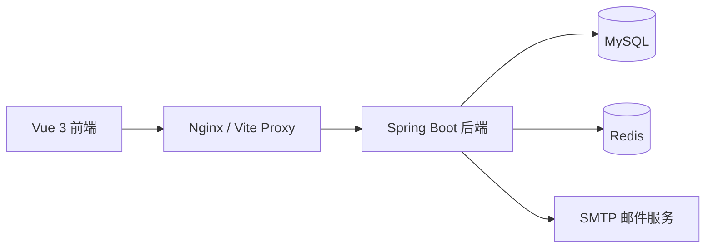
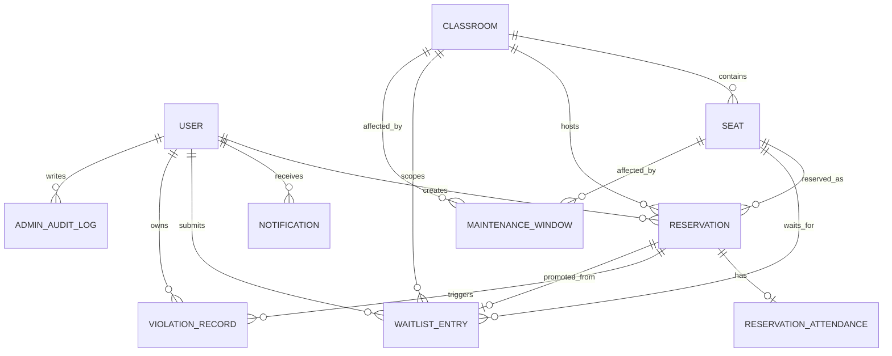
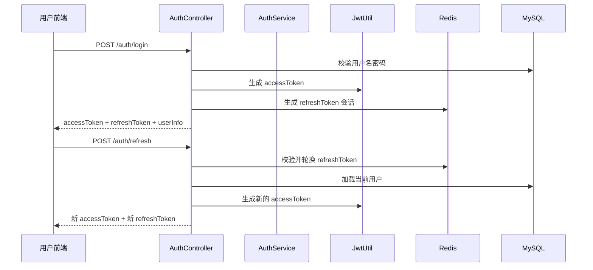
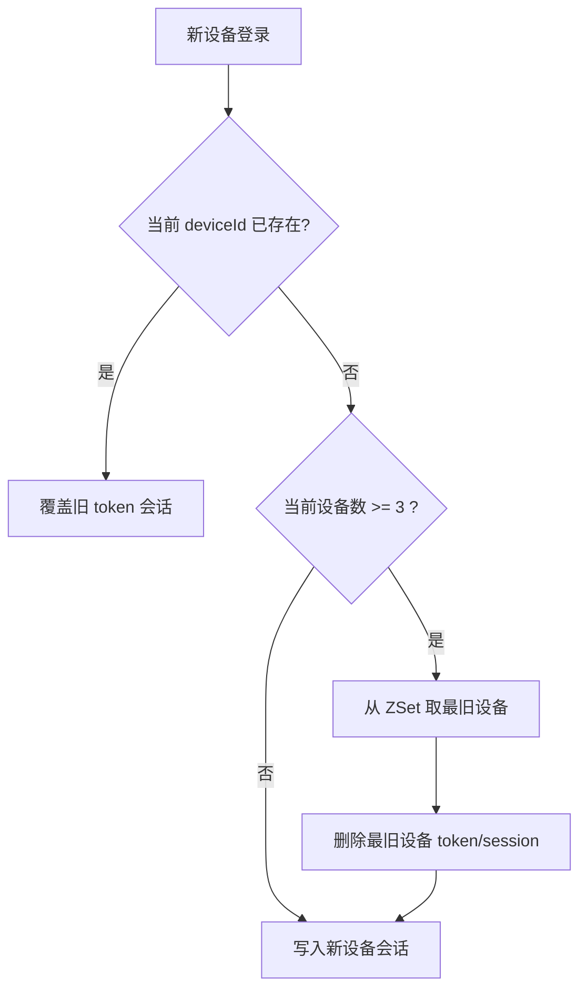
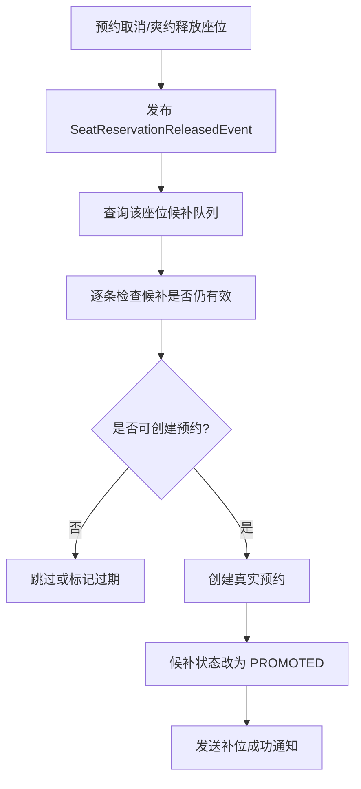

# 系统设计说明

## 1. 项目定位

校园教室预约管理系统面向学生、教师与管理员三类角色，目标是解决以下问题：

- 教室与座位预约冲突难控制
- 签到、爽约、信用约束缺少自动化
- 热门座位取消后资源无法自动回补
- 管理后台缺少统一治理、强制下线与审计能力

系统不仅覆盖预约主流程，还引入了双 token 认证、Redis 设备会话、邮箱验证码、候补补位、管理员审计日志等增强能力。

## 2. 总体架构

### 2.1 技术架构



### 2.2 分层设计

后端采用典型分层结构：

- `controller`：接口层，处理 HTTP 请求与参数校验
- `service`：业务层，处理预约、签到、认证、候补等核心逻辑
- `mapper`：数据访问层，基于 MyBatis 操作 MySQL
- `entity`：数据库实体
- `dto`：接口入参
- `vo`：接口出参
- `security`：JWT 认证、用户上下文、设备上下文
- `config`：安全、Swagger 等配置

前端采用模块化结构：

- `views`：页面级视图
- `components`：可复用组件
- `api`：请求封装与拦截器
- `stores`：Pinia 状态管理
- `router`：路由与权限控制

## 3. 模块划分

### 3.1 认证与账号模块

职责：

- 用户名密码登录
- 邮箱验证码登录
- 注册与找回密码
- 修改密码、修改昵称
- access token / refresh token 管理
- 登录设备管理
- 单设备下线与全部下线

核心后端入口：

- `AuthController`
- `AuthServiceImpl`
- `TokenServiceImpl`
- `JwtAuthenticationFilter`
- `JwtUtil`

### 3.2 教室与座位模块

职责：

- 教学楼查询
- 教室列表查询
- 教室详情与座位布局查询
- 已预约座位占用查询
- 管理员创建教室、初始化座位、维护座位状态

### 3.3 预约模块

职责：

- 学生预约座位
- 教师预约整间教室
- 预约取消
- 当前预约与历史预约查询
- 时间冲突校验
- 预约额度与信用等级约束

### 3.4 签到与信用模块

职责：

- 签到窗口控制
- 超时未签到自动记为爽约
- 取消预约扣分
- 爽约扣分
- 连续成功签到奖励
- 每日信用分恢复

### 3.5 候补模块

职责：

- 学生提交座位候补
- 查询和取消候补
- 座位释放后自动尝试补位
- 补位成功后发送通知

### 3.6 通知模块

职责：

- 系统通知列表
- 未读通知数量
- 全部标记已读
- 管理员封禁、取消预约、候补补位等事件通知

### 3.7 管理后台模块

职责：

- 数据总览与统计分析
- 用户管理
- 教室与座位管理
- 预约管理
- 维护窗口管理
- 系统配置管理
- 强制下线用户
- 审计日志查询

## 4. 数据库 E-R 设计



## 5. 核心表结构

下面只列文档说明最需要关注的表。

### 5.1 `user`

作用：

- 存储用户账号、角色、状态、信用分、JWT 版本号

关键字段：

| 字段 | 类型 | 说明 |
| --- | --- | --- |
| `id` | bigint | 用户主键 |
| `username` | varchar(50) | 登录用户名，唯一 |
| `password` | varchar(255) | BCrypt 密码 |
| `nickname` | varchar(50) | 昵称 |
| `email` | varchar(100) | 邮箱，唯一 |
| `role` | varchar(20) | `ADMIN` / `TEACHER` / `STUDENT` |
| `status` | tinyint | 1 启用，0 禁用 |
| `credit_score` | int | 学生信用分 |
| `token_version` | int | JWT 版本号 |

### 5.2 `classroom`

作用：

- 存储教室基础信息与座位矩阵规模

关键字段：

| 字段 | 说明 |
| --- | --- |
| `room_number` | 教室编号 |
| `building` | 教学楼 |
| `seat_rows` / `seat_cols` | 座位布局行列 |
| `status` | 教室是否可用 |

### 5.3 `seat`

作用：

- 存储座位布局、坐标、状态

关键字段：

| 字段 | 说明 |
| --- | --- |
| `classroom_id` | 所属教室 |
| `seat_number` | 座位编号 |
| `row_no` / `col_no` | 座位坐标 |
| `status` | `ENABLED` / `DISABLED` |

### 5.4 `reservation`

作用：

- 存储座位预约与整间教室预约

关键字段：

| 字段 | 说明 |
| --- | --- |
| `user_id` | 预约用户 |
| `resource_type` | `SEAT` / `CLASSROOM` |
| `resource_id` | 资源主键 |
| `classroom_id` | 所属教室 |
| `reserve_date` | 预约日期 |
| `start_time` / `end_time` | 预约时间段 |
| `status` | `ACTIVE` / `CANCELLED` / `EXPIRED` |

### 5.5 `reservation_attendance`

作用：

- 存储学生座位预约签到结果

关键字段：

| 字段 | 说明 |
| --- | --- |
| `reservation_id` | 关联预约 |
| `status` | `PENDING` / `CHECKED_IN` / `NO_SHOW` / `CANCELLED` |
| `check_in_time` | 实际签到时间 |

### 5.6 `waitlist_entry`

作用：

- 存储学生候补申请

关键字段：

| 字段 | 说明 |
| --- | --- |
| `user_id` | 候补用户 |
| `seat_id` | 候补座位 |
| `classroom_id` | 所属教室 |
| `start_time` / `end_time` | 候补时间段 |
| `status` | `WAITING` / `PROMOTED` / `CANCELLED` / `EXPIRED` |
| `promoted_reservation_id` | 补位成功后的预约 ID |

### 5.7 `system_config`

作用：

- 存储预约、签到、信用分规则配置

典型配置项：

- `reservation.level_a_max_single_minutes`
- `reservation.level_a_daily_max_minutes`
- `attendance.check_in_early_minutes`
- `attendance.check_in_grace_minutes`
- `credit.no_show_deduction`
- `credit.cancel_deduction`
- `credit.level_a_advance_hours`
- `ui.reservation_start_time`
- `ui.reservation_end_time`

### 5.8 `admin_audit_log`

作用：

- 存储管理员关键操作审计记录

关键字段：

| 字段 | 说明 |
| --- | --- |
| `admin_user_id` | 管理员 ID |
| `admin_username` | 管理员用户名 |
| `action_type` | 操作类型 |
| `target_type` | 目标对象类型 |
| `target_id` | 目标主键 |
| `target_name` | 目标名称 |
| `detail` | 操作详情 |
| `ip` | 来源 IP |
| `create_time` | 操作时间 |

## 6. 接口设计

完整接口可参考 [接口文档.md](/D:/JavaProject/campusClassroomReservationSystem/接口文档.md)。这里保留系统设计说明最需要的接口分组。

### 6.1 认证接口

| 方法 | 路径 | 说明 |
| --- | --- | --- |
| `POST` | `/auth/login` | 用户名密码登录 |
| `POST` | `/auth/login/code` | 邮箱验证码登录 |
| `POST` | `/auth/email-code` | 发送邮箱验证码 |
| `POST` | `/auth/register` | 注册学生账号 |
| `POST` | `/auth/password/reset` | 邮箱验证码重置密码 |
| `GET` | `/auth/me` | 获取当前用户 |
| `GET` | `/auth/devices` | 获取当前账号在线设备 |
| `DELETE` | `/auth/devices/{deviceId}` | 下线单个设备 |
| `PUT` | `/auth/password` | 修改密码 |
| `PUT` | `/auth/nickname` | 修改昵称 |
| `POST` | `/auth/refresh` | 刷新 access token |
| `POST` | `/auth/logout` | 当前账号全部下线 |

### 6.2 教室与座位接口

| 方法 | 路径 | 说明 |
| --- | --- | --- |
| `GET` | `/classrooms/buildings` | 获取教学楼列表 |
| `GET` | `/classrooms/available_list` | 查询可用教室 |
| `GET` | `/classrooms/{id}` | 教室详情 |
| `GET` | `/classrooms/{id}/seats` | 座位布局 |
| `GET` | `/classrooms/{id}/reserved_seats` | 查询指定时段已占用座位 |
| `GET` | `/classrooms/preferred_buildings` | 当前用户偏好楼栋 |

### 6.3 预约接口

| 方法 | 路径 | 说明 |
| --- | --- | --- |
| `POST` | `/reservations/seats` | 学生预约座位 |
| `POST` | `/reservations/classrooms` | 教师预约整间教室 |
| `DELETE` | `/reservations/{id}` | 取消预约 |
| `POST` | `/reservations/{id}/check-in` | 学生签到 |
| `GET` | `/reservations` | 当前预约 |
| `GET` | `/reservations/history` | 历史预约 |

### 6.4 候补接口

| 方法 | 路径 | 说明 |
| --- | --- | --- |
| `POST` | `/waitlist` | 提交候补 |
| `GET` | `/waitlist/my` | 查询我的候补 |
| `DELETE` | `/waitlist/{id}` | 取消候补 |

### 6.5 通知接口

| 方法 | 路径 | 说明 |
| --- | --- | --- |
| `GET` | `/notifications` | 通知列表 |
| `GET` | `/notifications/unread-count` | 未读通知数 |
| `PATCH` | `/notifications/read-all` | 全部标记已读 |

### 6.6 管理员接口

| 模块 | 典型路径 | 说明 |
| --- | --- | --- |
| 数据总览 | `/admin/analytics` | 查看统计分析 |
| 教室管理 | `/admin/classrooms/**` | 创建、更新教室与座位布局 |
| 用户管理 | `/admin/users` | 查询、封禁/恢复用户 |
| 强制下线 | `/admin/users/{id}/logout` | 下线目标用户全部设备 |
| 预约管理 | `/admin/reservations/**` | 检索、取消预约 |
| 维护管理 | `/admin/maintenance/**` | 创建、取消维护窗口 |
| 配置管理 | `/admin/configs/**` | 修改预约与信用规则 |
| 审计日志 | `/admin/audit-logs` | 查询操作日志 |

## 7. 认证流程设计

### 7.1 accessToken + refreshToken 模型

系统采用双 token 模型：

- `accessToken`：短期有效，放在请求头 `Authorization: Bearer <token>`
- `refreshToken`：长期有效，保存在客户端本地，用于换发新的 `accessToken`

认证关键点：

- `accessToken` 中写入 `userId`、`username`、`role`、`tokenVersion`、`deviceId`
- `refreshToken` 不直接暴露在 Redis key 中，而是先做 `SHA-256` 哈希
- `JwtAuthenticationFilter` 会同时校验：
  - JWT 是否有效
  - `tokenVersion` 是否与数据库一致
  - `deviceId` 是否仍存在于 Redis 活跃设备会话

### 7.2 认证流程图



## 8. 设备会话流程设计

### 8.1 设计目标

- 支持查看当前账号在线设备
- 支持单设备下线
- 支持全部下线
- 最多允许 3 台设备同时登录
- 新设备登录时自动挤掉最旧设备

### 8.2 Redis 键设计

#### 1. refresh token 会话对象

Key：

```text
crs:login:refresh:token:{tokenHash}
```

Value（Hash）：

```json
{
  "userId": "1001",
  "deviceId": "chrome-windows-uuid",
  "deviceName": "Chrome on Windows",
  "loginTime": "1710000000"
}
```

#### 2. 用户 refresh token 索引

```text
crs:login:refresh:user:{userId}
```

类型：

- `Set`

用途：

- 快速撤销某个用户全部 refresh token

#### 3. 用户设备映射

```text
crs:login:device:user:{userId}
```

类型：

- `Hash`

字段：

- `deviceId -> tokenHash`

#### 4. 用户设备时间索引

```text
crs:login:device:zset:{userId}
```

类型：

- `ZSet`

成员与分数：

- `member = deviceId`
- `score = loginTime`

### 8.3 三设备上限策略

策略如下：

1. 同一 `deviceId` 再次登录：覆盖旧会话，不增加设备数
2. 新 `deviceId` 登录且设备数未满：直接写入新会话
3. 新 `deviceId` 登录且设备数已满 3 台：自动删除最早登录设备，再写入新会话

### 8.4 设备会话流程图



## 9. 候补补位流程设计

### 9.1 业务目标

当某个座位预约被取消或因爽约释放时：

- 不让空出的座位浪费
- 自动尝试把最合适的候补申请转正
- 给候补成功的用户发送系统通知

### 9.2 核心机制

实现方式：

1. 座位预约被取消或超时释放时，发布 `SeatReservationReleasedEvent`
2. `WaitlistServiceImpl` 监听事件
3. 读取该座位、该时间段的候补队列
4. 逐个尝试重新创建真实预约
5. 成功后将候补状态标记为 `PROMOTED`
6. 发送 `WAITLIST_PROMOTED` 通知

### 9.3 候补补位流程图



## 10. 预约规则设计

### 10.1 角色差异

- 学生：预约座位，需要签到，受信用等级与每日额度约束
- 教师：预约整间教室，不需要签到，额度限制更宽松
- 管理员：不直接走普通预约流程，主要负责治理与维护

### 10.2 冲突校验

预约前会校验：

- 预约开始时间和结束时间是否合法
- 是否跨自然日
- 是否超过单次预约时长
- 是否超过当前信用等级可提前预约时长
- 是否超过当日累计预约时长
- 目标教室、座位是否可用
- 是否与已有预约冲突
- 是否与维护窗口冲突
- 学生是否在同一时段已有其他预约

## 11. 签到与信用规则设计

### 11.1 签到窗口

默认规则来自 `system_config`：

- 提前签到窗口：`10` 分钟
- 延迟签到窗口：`15` 分钟

含义：

- 学生只能在开始前 10 分钟到开始后 15 分钟之间签到

### 11.2 爽约处理

如果用户在宽限时间内未签到：

- `reservation_attendance.status` 标记为 `NO_SHOW`
- 预约状态自动取消
- 回滚预约占用时长
- 扣除信用分
- 写入违约记录
- 发送系统通知
- 若为座位预约，则触发候补补位事件

### 11.3 信用等级

当前信用规则基于 `system_config` 动态配置：

- A 级：高信用，预约额度更高
- B 级：中等信用
- C 级：低信用，预约时长与提前时长更低

## 12. 管理员治理设计

### 12.1 强制下线

管理员可对普通用户执行强制下线：

- 递增目标用户 `tokenVersion`
- 撤销该用户全部 refresh token
- 使其所有 access token 即刻失效
- 写入系统通知

### 12.2 审计日志

当前已覆盖的关键动作包括：

- 用户状态修改
- 强制下线用户
- 管理员取消预约
- 系统配置修改
- 教室创建与更新
- 维护创建与取消

## 13. 安全设计要点

- Spring Security + JWT 鉴权
- 后端无状态，Session 策略为 `STATELESS`
- 密码使用 `BCrypt`
- `refreshToken` 以哈希后的 token 作为 Redis 标识
- 使用 `tokenVersion` 实现全局 token 失效
- 使用 `deviceId` + Redis 设备会话实现单设备失效
- 邮箱验证码带有效期与冷却时间
- 管理员接口统一走 `/admin/**` 并受角色约束

## 14. 可扩展性说明

当前设计已经具备继续演进的基础，后续可以平滑扩展：

- 管理员查看某用户的在线设备详情
- 预约改签、续约
- 审计日志导出
- 服务端分页与高级筛选
- Flyway/Liquibase 数据库迁移
- 更多通知渠道，如短信或企业微信
